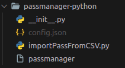

# Python MongoDB Password Manager
````
-----------------------------------------------------
                                                   __ 
    ____  ____  ____ ____ _      _  ___  _____ ___/ /                                            
   / __ \/ __ `/ ___/ ___/ | /| / / __ \/ ___/ __  / 
  / /_/ / /_/ (__  |__  )| |/ |/ / /_/ / /  / /_/ /   
 / .___/\__,_/____/____/ |__/|__/\____/_/   \__,_/    
/_/____ ____  ____  ___  _________ _/ /_____  ____  
/ __ `/ _ \/ __ \/ _ \/ ___/ __ `/ __/ __ \/ ___/   
/ /_/ /  __/ / / /  __/ /  / /_/ / /_/ /_/ / / _     
\__, /\___/_/ /_/\___/_/   \__,_/\__/\____/_/        
/___/
                                              
-------------------------------------------------------------------------
[+]  This Tool is Developed by Praveen M S
[+]  Github: https://github.com/Praveenms13/PasswordManager-cmdline-tool
[+]  Portfolio: https://rootwitch.praveenms.site
-------------------------------------------------------------------------
````
## Introduction

Python MongoDB Password Manager is a secure and convenient tool for storing and managing your passwords using MongoDB, a popular NoSQL database. With this password manager, you can securely store your passwords and retrieve them whenever needed, all within a user-friendly command-line interface.

## Features

- Generate strong, random passwords and automatically save to db and copy to clipboard
- Strong encryption to protect your passwords
- Securely store and manage your passwords
- Passwords are stored in the database in symmetric encryption
- User-friendly command-line interface
- Create, view, update, and delete password entries
- Automatically Copy passwords to the clipboard for easy use
- Search for passwords by account name or username

The cryptography.fernet module does not directly deal with hashing. Instead, it focuses on symmetric encryption, which uses a shared secret key to both encrypt and decrypt data.

Fernet employs a combination of symmetric encryption and message authentication codes (MACs) to provide confidentiality and integrity for the encrypted data.

## Prerequisites

Before running this password manager, please ensure that the following requirements are met:

- Python 3.x is installed on your system.
- MongoDB is installed and running.

## Installation

To Download and install the tool :

```bash
git@github.com:Praveenms13/PasswordManager-cmdline-tool.git
```

After downloading the tool and go inside the dir

`$ cd PassManager/passwordmanager/`

Then run $ pwd

`$ pwd`

`/home/Desktop/PassManager/passwordmanager`

Copy the above directory and paste it with a path

`$ nano ~/.bashrc`

Paste the below command

`export PATH=$PATH:/home/Developer/linuxTools/PassManager/passwordmanager/
`

Then refresh the terminal, reopen the terminal

install the required packages

```
pip install pymongo
pip install json
pip install sys
pip install os
pip install secrets
pip install string
pip install subprocess
sudo apt-get install xclip
```

## Environment Variables

To run this project, you will need to add the following environment variables to your `config.json` file.
<br><br>
### Create `config.json` file 
<br>


<br><br>
To add the mongodb connection url in `config.json` file do

```
passlock --edit=<connection url>
connection url looks like:
<mongodb+srv://<user-name>:<user-password>@cluster0.ylmuuht.mongodb.net/>
```

after adding the env variables, call the contents from `config.json` file from `passManager` python file

`config.json` Looks like

```
{
    "mongoConnectionUrl": "<mongodb+srv://<user-name>:<user-password>@cluster0.ylmuuht.mongodb.net/>",
}
```

calling the mongo connection url looks like

```
current_dir = os.path.dirname(os.path.abspath(__file__))
with open(f"{current_dir}/config.json","r",) as f:
    data = json.load(f)
    return data
```

## Add Your public ip in mongodb dashboard

click "add ip address" on top right corner in the below dashboard and add you public ip address. You can obtain your public ip from https://whatismyipaddress.com/

## Hurrah!! Setup Completed.

Now run the tool as below with start point
`$ passManager`

## Tool Usage

Order of Execution:

```
-gp=<condition> -l=<num> -s -cp
```

## Usage:

Section 1 :

```
Usage: passlock [options]

    Options:
    --addCredentials, -ac    Add credentials to the database.
                            Requires the following additional options:
                            --platform, -pl     Specify the platform (required).
                            --username, -u      Specify the username (required).
                            --password, -pa     Specify the password.

    --getCredentials, -gc    Get credentials from the database.
                            Requires the following additional options:
                            --platform, -pl     Specify the platform (required).
                            --username, -u      Specify the username (required).

    --getCredentialsPlatform, -gcp
                            Get credentials from the database based on platform.
                            Requires the following additional option:
                            --platform, -pl     Specify the platform (required).

    --deleteCredentials, -dc
                            Delete credentials from the database.
                            Requires the following additional options:
                            --platform, -pl     Specify the platform (required).
                            --username, -u      Specify the username (required).

    --updateCredentials, -uc
                            Update credentials in the database.
                            Requires the following additional options:
                            --platform, -pl     Specify the platform (required).
                            --username, -u      Specify the username (required).

    --generatepassword, -gp  Generate a password.
                            Requires the following additional options:
                            --generatepassword, -gp   Specify the password type (required).
                            --length, -l               Specify the password length.

    --save, -s               Save the generated password to the database.
                            Note: Requires platform, username, and comment.

    --copy, -cp              Copy the generated password to the clipboard.

Note:
    - For options that require values, you can use either the long or short form.

For example, --platform or -pl.
    - Make sure to provide the required options for each command.
    - The script will exit after executing each command.
```

Section 2:

```
Usage: passlock [options]

        Options:
        --generatepassword, -gp <condition>    Generate a new password.
                                            Available conditions: alphanumeric, alphabets, numeric, symbols.
        --save, -s                            Save the generated password in the database.
        --copy, -cp                           Copy the generated password to clipboard.
        --length, -l <num>                    Specify the length of the password.

        Order of execution: python script.py -gp=<condition> -l=<num> -s -cp

        Example usage:
        python script.py -gp=alphanumeric -l=10 -s -cp
            Generates a new alphanumeric password with a length of 10 characters,
            saves it in the database, and copies it to the clipboard.

Note:
        - The script will exit after executing each command.
```
